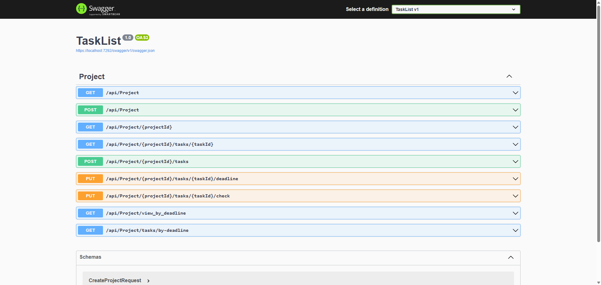

# TaskList Application

A flexible task management application that can run both as a console application and a web API. Built with .NET 8.0, this application provides a robust solution for managing tasks and projects.

## Features

- Dual-mode operation:
  - Console-based interface for command-line usage
  - Web API interface with Swagger documentation
- Task management capabilities
- Project organization
- Command-based interaction
- Comprehensive test coverage

## Prerequisites

- .NET 8.0 SDK or later
- An IDE (Visual Studio, VS Code, or Rider recommended)

## Project Structure

```
TaskList/
├── TaskList/                 # Main application project
│   ├── Controllers/         # Web API controllers
│   ├── Core/               # Core business logic and models
│   ├── Interfaces/         # Interface definitions
│   └── Program.cs          # Application entry point
├── TaskList.Tests/         # Test project
│   ├── CommandTests.cs     # Command processing tests
│   ├── ModelTests.cs       # Model validation tests
│   ├── ProjectControllerTests.cs  # API controller tests
│   └── TaskServiceTests.cs # Service layer tests
└── TaskList.sln            # Solution file
```

## Running the Application

### Console Mode

To run the application in console mode:

```bash
dotnet run -- --cli
```

### Web API Mode

To run the application as a web API:

```bash
dotnet run
```

The API will be available at `https://localhost:5001` and `http://localhost:5000`.
Swagger documentation will be available at `/swagger` when running in Development mode.

### Swagger UI

The Swagger UI provides interactive documentation for all available API endpoints:



## Testing

The project includes comprehensive tests covering:

- Command processing
- Model validation
- API endpoints
- Service layer functionality

To run the tests:

```bash
dotnet test
```

## Dependencies

- Microsoft.AspNetCore.OpenApi (8.0.5)
- Swashbuckle.AspNetCore (6.4.0)

## Development

The application follows clean architecture principles with:

- Clear separation of concerns
- Interface-based design
- Dependency injection
- Comprehensive test coverage

## License

This project is proprietary and confidential.
